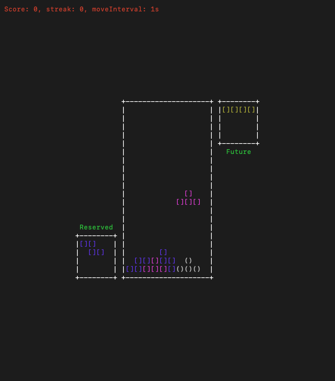

# Go-Tetris

I was just missing to write something in Go. So here is a very basic Tetris clone done using only [Termbox](https://github.com/nsf/termbox-go).

## TODOs

- Add a main page with a menu and a score saving system
- Maybe add sounds
- Add AI
- Add a multiplayer mode

## How to run

`go run -v .` 

- win64 .exe in /bin

## Screenshots

